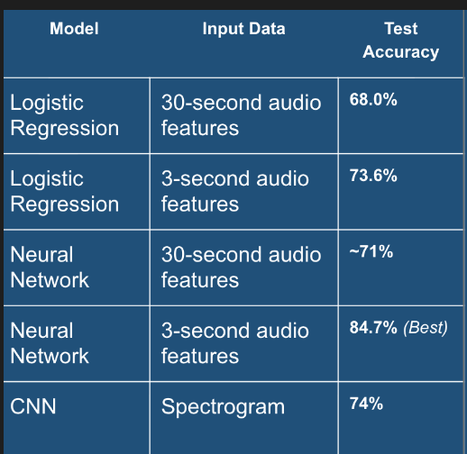
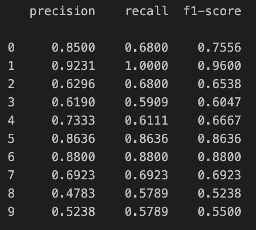

# CS 4100 Course Project: Fall 2025

Sean Ediger and Ayuko Okuzawa

**Abstract**

Our goal in this project was to identify different ways to be able to classify songs into different genres using different ML technologies. The dataset we used for this was the GTZAN dataset (https://www.kaggle.com/datasets/andradaolteanu/gtzan-dataset-music-genre-classification/data) with 10 music genre labels. We mainly used 2 different types of data in this dataset, Tabular and Image data. For the Tabular features we decided to use smaller logistic regression models and then make our way up to more advanced neural networks. For image data (spectrograms), as you might be able to guess, we used CNN's for the task.

**Overview**

Problem:

The problem we are trying to solve here is building a baseline on predicting and classifying songs based on genre. Our motivation for this is as avid music listeners and enthusiasts, sometimes it can be difficult to pinpoint the genre of a song you are listening to, especially if you are completely unaware of the genre of a song you are listening to. Being able to predict and classify these song means gaining more clarity on music exploration and can potentially give clarity on knowing what kind of songs you like more or not like. This problem is interesting because there are many different avenues in which to pursue this. You have so many types of data that can represent music and it's interesting investigating which does best for some things and what might do better for others. I also think that this problem is interesting because it is mixing AI and technology with music / art. The arts are one use case in which people claim AI is behind in compared to other subjects so it's interesting to see the transformation from music -> usable data -> trained model.

Approaches (broad):

Since we had access to a few different data sources, we decided to take a few different approaches to tackle this problem. The three types of data we had access to in this dataset were extracted tabular data, spectrograms (image data), and then the actual audio files. Our way of thinking leading up to this project was start as simple as possible and then work our way up to more complicated models. Our first model we used was simple logistic regression with the tabular data. We thought this would be the easiest way to start off and it was. Next we moved onto using the same data and fitting it with a neural network. We chose to use these approaches first becuase they are very interpretable and it gave us a good baseline for slightly more complex models we might train in the future. We then moved onto using the spectrograms (image data), and we thought the best model for this approach would be CNNs. We used CNNS for this because they they allow for faster and more efficient training of the large data that needs to be processed. A limit to the tabular models that we trained was the amount of data we had as a whole. For this data, we had two datasets, extracted features from 30 second audio clips and 3 second audio clips. The dataset with 30 second clips only had 1,000 entries compared to the 10,000 entries of the 30 second clips so using the longer duration clips proved to be more challenging to get good test results. The CNN results are potentialy limited by training a brand new model from scratch, as opposed from using a pretrained model.

There are plenty of references online of similar ways that we could have gone about solving this problem, but we both thought it might be better for us to learn this by ourselves on the first pass through.

**Approaches**

Overall Methodology:

**For Logistic Regression (Did this for 30 second audio clips AND 3 second audio clips):**

Steps:

1. Import and Clean data (filter out unwanted features, standardize, and split into train/test)
2. Train Logistic Regression model with train data
3. Evaluate model using accuracy and classification report
4. Go back and tweak model if necessary

Model Architecture:

* Input: Extracted audio clip features (30 seconds and 3 second seperately trained models)

* Classifier: Multiclass logistic regression (softmax).
* Optimization: LBFGS optimizer with L2 regularization.
* Purpose: Establishes a simple linear baseline.

Assumptions:
    This model assumes that all the features inputted have a linear relationship with the genre / label.

Limitations:
    Can only capture linear relationships.

Hardware / Environment:
    scikit-learn in Python.
    Run on local CPU

**For Neural Network Model (Did this for 30 second audio clips AND 3 second audio clips):**

Steps:
1. Import and Clean data (same as logistic regression cleaning)
2. Initialize model architecture and train using train data
3. Evaluate model with test data with accuracy and classification reports
4. Go back and tweak model if necessary

Model Architecture:

- Input (57)
- Linear (57 → 128)
- ReLU
- Dropout (p = 0.2)
- Linear (128 → 64)
- ReLU
- Linear (64 → 32)
- ReLU
- Linear (32 → 10)
- Softmax output
- Loss Function: CrossEntropy Loss
- Optimizer: SGD

Assumptions:This model assumes that this audio data can be used as a non-linear combination to predict genre

Limitations:
    Higher Overfitting Risk on Smaller Datasets.

Hardware / Environment:
    Pytorch in python
    Run on local CPU

**For our Convolutional Neural Network Model**

Steps:
1. Load spectrogram images and apply preprocessing to all images: resize to 128 × 128, convert to tensor, and normalize.
2. Split the full dataset into 80% train and 20% test
3. Initialize the CustomCNN model architecture and train using train data
4. Compute test accuracy and later generate a classification report from predictions.
5. Go back and tweak model if necessary

Model Architecture:
* Input: 3 × 128 × 128 RGB spectrogram image

* Conv Block 1:
    * Conv2d(3 → 32, kernel_size=3, padding=1)
    * BatchNorm2d(32)
    * ReLU
    * MaxPool2d(2×2)
* Conv Block 2:
    * Conv2d(32 → 64, kernel_size=3, padding=1)
    * BatchNorm2d(64)
    * ReLU
    * MaxPool2d(2×2)
* Conv Block 3:
    * Conv2d(64 → 128, kernel_size=3, padding=1)
    * BatchNorm2d(128)
    * ReLU
    * MaxPool2d(2×2)
* Conv Block 4:
    * Conv2d(128 → 256, kernel_size=3, padding=1)
    * BatchNorm2d(256)
    * ReLU
    * MaxPool2d(2×2)
* Flatten + Classifier:
    * Flatten feature maps: 256 × 8 × 8 → 256 * 8 * 8
    * Dropout(p = 0.6)
    * Linear(256 * 8 * 8 → num_classes)

* Loss Function: CrossEntropyLoss
    Optimizer: Adam with learning rate 0.0001 and weight decay 1e-5 (L2 regularization)

Assumptions:
    This CNN assumes that genre-specific information is encoded in time–frequency patterns of the spectrogram images.

Limitations:
    It treats each spectrogram as a static image and therefore does not explicitly model long-term temporal song structure
    
Hardware / Computing Environment:
    Implemented using PyTorch and Torchvision in Python.
    CUDA-enabled GPU when available
    Otherwise Apple MPS GPU backend
    Otherwise CPU fallback

**Experiments**

Datasets:

1. Spectrograms: Images that represent frequency content over time of an audio file. Each sample is an RGB image resized to 128 × 128 pixels. Used as input for the Convolutional Neural Network.

2. Tabular Data: 3-second and 30-second extracted features from an audio file (pre-extracted). Each row represents one song segment with a corresponding genre label. Feature columns include statistical descriptors such as spectral, tempo, MFCC-derived, etc. This data was used with the neural networks and the logistic regression models we created.

**Results**

Main Results: Our main results show that the best model out of all 5 models we trained, was the neural network model trained on the extracted data from the 3 second audio clips. As you can see from the table below, this got around a 85% accuracy on the test data. All the other models didn't do terribly, all getting around a 69% - 74% accuracy on the test set. One common trend we saw with the tabular data in particular is the models trained on the 30 second clips did consistently worse at predicted song genre than the models trained on the 3 second audio clip tabular data. Another trend we saw on the tabular data was it struggled much more wiith classifying certain genres than others. For example, in the table below on the right, you can see the classification report for all 10 labels for the NN trained on 30 second audio clip features. In this image you will notice that some accuracies for certain labels is significantly higher than others.

Supplementary Results - Parameter Choices:
    1. Logistic Regression:
        - Feature standardization: This was necessary because logistic regression is sensitive to feature scale
        - Optimizer: The LBFGS solver was selected because it is well-suited for multiclass softmax logistic regression.
        - Regularization: L2 regularization was used to try to stop overfitting of train data.
    2. NN Model:
        - Hidden layer dimensions (128 → 64 → 32): A gradually decreasing layer structure was used to compress learned representations and encourage abstraction of more important features.
        - Feature standardization: This was necessary because logistic regression is sensitive to feature scale.
        - Activation Function: ReLU was used for its computational efficiency and ability to stop vanishing-gradient issue.
        - Dropout rate: 0.2 dropout was used to further regularize the NN.
        - Optimizer: SGD was used because of its simplicity and reliability.
        - Loss function: CrossEntropyLoss was used becuase it is well suited for multiclass classification.
    3. CNN Model:
        - Batch Normalization: BatchNorm is placed after each convolution and before ReLU to normalize feature maps within each batch.
        - Weight decay: L2 regularization was applied to limit overfitting
        - Activation Functions: Relu was used to stop vanishing gradient problem and to make training more efficient and stable.
        - Dropout: A higher dropout rate of 0.6 was used to stop overfitting.
        - Optimizer: Adam optimizer was used for CNN training because of its adaptive learning rate.
        - Loss function: Cross entropy loss was used for the exact same reasons as the NN model.
        - Learning rate: A low learning rate of 0.0001 was used to prevent unstable training.
        - Pooling: 2x2 Max pooling is used after each block to lessen the dimensions, increasing efficiency and forcing the CNN to focus on strongest activations.

**Discussion**

Some aspects of our results were good and were up to our expectation, while others weren't as great. I thought that the Neural Network we trained on 3-second tabular features was what i expected with an 85% accuracy. There were some neural networks I found online that got up to a 90% accuracy with a similar architecture, but more layers and they also used sparse cross entropy instead of regular cross entropy. We also weren't too dissapointed by our baseline logistic regression models that we created as we weren't expecting great results from such a simple model. The model we were hoping to see better results from were our CNN model. While our results weren't horrible by any means (73% accuracy), we were hoping to at least see something on par with our NN model. I'm not too sure why these results weren't as good as we expected but it could be due to a smaller dataset for images than for what we had on the tabular data. We looked online for other people who tried to also use a CNN on the same data got very similar accuracy results. We also looked into it a bit more and using raw audio data instead of spectrograms could get a higher accuracy. That could be a next step on where this project takes us. Another area that I would like to work on is in mixed genre classification. As you probably know, music genre of a song isn't cut and dry. Most songs mix aspects from different genres and that could be an interesting was for this project to progress.

**Conclusion**

In this project, we aimed to investigate various ways ML can be used to classify music into different genres. We mainly used 3 modeling approaches: simple logistic regression, an artificial neural network (NN), and a convolutional neural network (CNN). Through experimentation using different data (extracted tabular audio features and spectrograms) comnined with different models, we found that that the NN trained on short (3-second) audio feature segments got the best overall generalization performance, reaching about 85% test accuracy. Models trained on longer segments seemed to do slightly worse (maybe due to smaller datasets). While we believed the CNN model would work well analyzing the spectrograms, it very slightly underperformed potentially due to the small dataset size as well, as other people showed similar results using the same data. Overall, these results provide a great foundation for future exploration using larger datasets, advanced deep learning architectures, and transfer learning,to continue to enhance our music analysis ability.

**References**
Dataset- https://www.kaggle.com/datasets/andradaolteanu/gtzan-dataset-music-genre-classification/data
Notebook Example - https://www.kaggle.com/code/guritagurih/genreclassification-mobilenetv2
CNN Example to check accuracy - https://www.kaggle.com/code/dapy15/music-genre-classification
